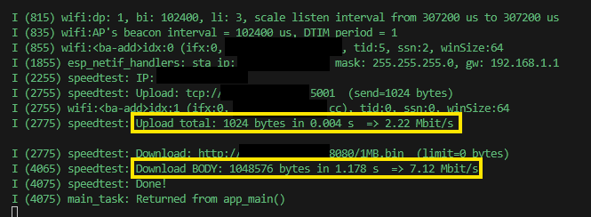

# ESP-IDF Wi-Fi HTTP/TCP Speedtest

Minimal throughput tests over Wi-Fi STA: HTTP download (no TLS) and raw TCP upload.  
Download measures only the HTTP body (after `\r\n\r\n`). Upload sends a fixed pattern and times the send path.

---

## What it does

1. Initializes Wi-Fi in STA mode and connects to your AP with power-save disabled (`WIFI_PS_NONE`).
2. Download path: connect to `DL_HOST:DL_PORT`, send `GET DL_PATH HTTP/1.1`, start timing on the first body byte, read until EOF/limit, log bytes, seconds, Mbit/s.
3. Upload path: connect to `UL_HOST:UL_PORT`, send `UL_TOTAL_BYTES` of 0xA5 payload in chunks, `shutdown(SHUT_WR)`, log bytes, seconds, Mbit/s.

---

## Configuration (main/esp32-net-speedtest.c)

```c
#define DL_HOST        "ADD_HOST_IP"
#define DL_PORT        8080
#define DL_PATH        "/1MB.bin"
#define DL_LIMIT_BYTES 0

#define UL_HOST        "ADD_UPLOAD_SINK_IP"
#define UL_PORT        5001
#define UL_TOTAL_BYTES (8*1024*1024)

#define WIFI_SSID "ADD_AP_SSID"
#define WIFI_PASS "ADD_AP_PASS"
```

---

## Requirements

- ESP-IDF (v5.x recommended)
- Python 3 (for the HTTP server and TCP sink)
- A Wi-Fi AP your ESP32 can join

---

## 1. Prepare the test file
`download/1MB.bin` is already provided. To recreate it (PowerShell):
```cmd
fsutil file createnew 1MB.bin 1048576
```

---

## 2. Start the servers
- Download (HTTP) server - from the `download/` folder containing `1MB.bin`:
```cmd
python -m http.server 8080
```
- Upload (TCP) sink - in a separate terminal, from `upload/`:
```cmd
cd upload
python tcp_sink.py
```

---

## 3. Flash and monitor the ESP32
Run `idf.py -p <PORT> flash monitor` (or your preferred monitor command).  
Example output:



---
